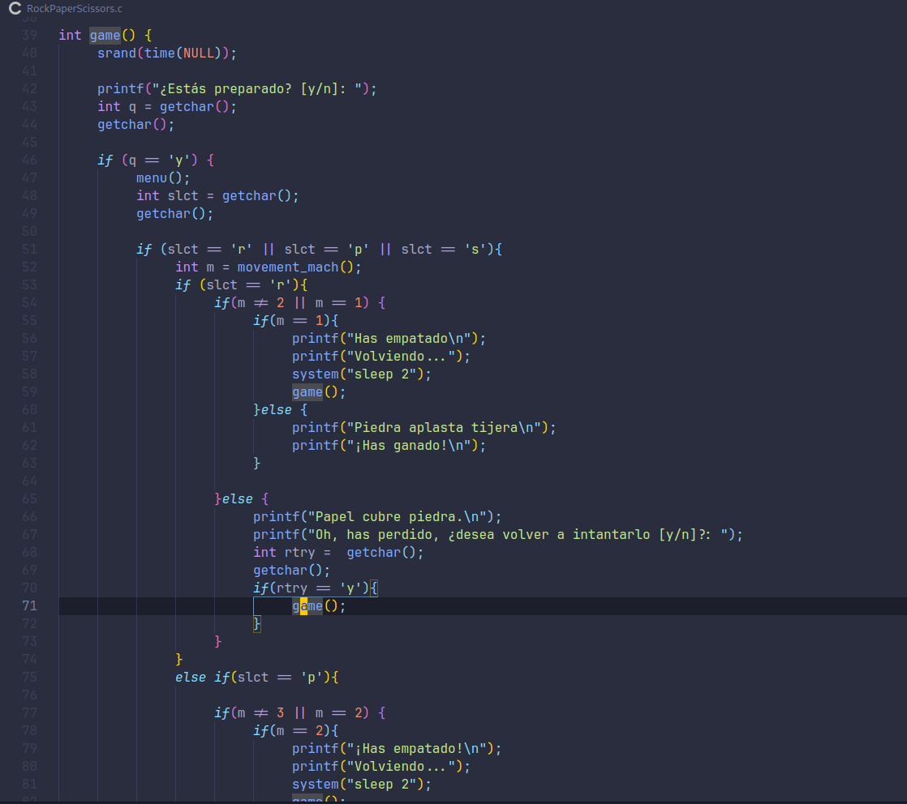

# Rock Paper Scissors en C
---

Mini proyecto de prueba con C. Piedra papel o tijeras recursivo.


## Ejecución
**Para ejecutar el codigo, solo necesitas el compilador de C (gcc).**

### Para instalarlo.

En Arch Linux.
```bash
sudo pacman -S gcc
```
En Ubuntu y Debian.
```bash
sudo apt install gcc
```

### Para complilar y ejecutar.

```bash
gcc -o RpS RockPaperScissors
./RpS
```
